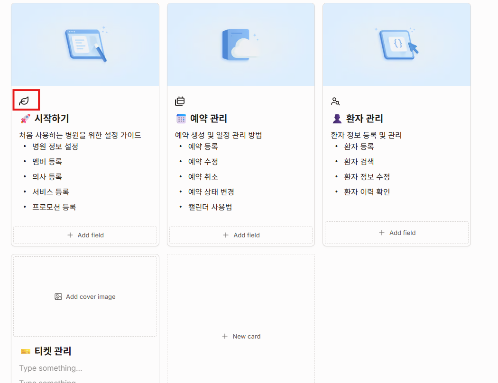

# AI Assistant Settings


📘 **In this guide, you'll learn how to:**

* Set the default language and AI models used by the AI Assistant
* Add and manage clinic information in the **Knowledge Base**
* Configure **Auto Response** settings and agent handoff conditions
* Add API keys required for external AI services
* Test AI responses using **Chat Preview**
* Check AI service connections and system status


## AI Assistant Settings Overview

Use **AI Assistant Settings** to manage the language, AI models, **Knowledge Base, Auto-Response, API Keys, Chat Preview, and System Status** used by Dr.OZ AI.

📌 Path: **Settings > Clinic Settings > AI Assistant Settings**

<table><thead><tr><th width="172.3333740234375">Menu</th><th>Description</th></tr></thead><tbody><tr><td><strong>Models</strong></td><td>Set the default AI Assistant language and select the AI model used for each feature.</td></tr><tr><td><strong>Knowledge Base</strong></td><td>Add and manage clinic information used by the AI Assistant.</td></tr><tr><td><strong>Auto-Response</strong></td><td>Configure automated AI responses and handoff settings.</td></tr><tr><td><strong>API Keys</strong></td><td>Add API keys required for external AI services.</td></tr><tr><td><strong>Chat Preview</strong></td><td>Test AI-generated responses before using them in actual conversations.</td></tr><tr><td><strong>System Status</strong></td><td>Check AI service connections and system status.</td></tr></tbody></table>

> 📌 To learn how to review AI-generated responses during patient conversations and handle inquiries handed off to staff, see the [**Dr.OZ AI Assistant**](../consultation-management/dr.oz-ai-assistant.md) guide.

***

## 1. AI Model Settings

Use the **Models** tab to set the AI Assistant's default language and choose the AI model used for each feature. After making changes, click **\[Save]** to apply them.

<figure><figcaption></figcaption></figure>

<table><thead><tr><th width="241.75">Setting</th><th width="201.5">Used for</th><th>Description</th></tr></thead><tbody><tr><td><strong>① AI Assistant Language</strong></td><td>Default AI language</td><td>Choose <strong>Auto Detect</strong> or select a specific language, such as Korean, English, or Chinese.</td></tr><tr><td><strong>② Chat Consultation</strong></td><td>Patient conversations</td><td>Select the AI model used to generate suggested replies during patient conversations.</td></tr><tr><td><strong>③ Appointment Assistant</strong></td><td>Appointment booking</td><td>Select the AI model used for appointment-related AI features.</td></tr><tr><td><strong>④ KB Builder</strong></td><td>Knowledge Base</td><td>Select the AI model used to analyze and organize Knowledge Base content.</td></tr><tr><td><strong>⑤ Reminder Bot</strong></td><td>Appointment reminders</td><td>Select the AI model used when generating appointment reminder content.</td></tr></tbody></table>

> 💡 With **Auto Detect**, AI automatically identifies the patient's language and responds in the same language.
>
> Available AI models may vary depending on your clinic's system configuration. **Some models require an API key for the corresponding AI service.**

***

## 2. Knowledge Base

The **Knowledge Base** stores clinic information that Dr.OZ AI can reference when answering patient questions.

You can add information using **text** or a **website URL**, then update existing items as needed.

> 💡 Keeping your **Knowledge Base** up to date helps improve the accuracy of AI responses. Update or remove outdated information when needed.

#### Add Knowledge

Use **\[+ Add Knowledge]** to add clinic information such as clinic details, FAQs, services, treatment information, or other content that AI should reference.

**Add Text**

1. Click **\[+ Add Knowledge] > \[Text]**.
2. Enter the information you want to add.
3. Click **\[Process with AI]** to process and add the information to the Knowledge Base.

<figure><figcaption></figcaption></figure>

> 💡 **\[Process with AI]** organizes the information you enter so that AI can use it naturally in patient conversations. Short or abbreviated notes can also be converted into clearer conversational content.

✅ **Example**

* **Before:** Operating hours: Mon–Fri 9am–7pm, alternate Saturdays closed
* **After AI processing:** We are open Monday through Friday from 9:00 AM to 7:00 PM. We are closed every other Saturday.

***

#### **Add a Website URL**

Select **\[+ Add Knowledge] > \[Website URL]**, then enter your clinic website URL.

Dr.OZ AI will analyze accessible website content and extract information that can be added to the Knowledge Base. This can be useful when your website contains multiple pages of clinic information.

<figure><figcaption></figcaption></figure>

> ⚠️ Websites that require login or additional access permissions may not be accessible to AI. In this case, the content may not be added to the Knowledge Base.

***

### Edit Knowledge

You can update the **category, title, content, and image** of an existing Knowledge Base item.

1. Find the item you want to update in the **Knowledge Base** list.
2. Open the item and click **\[Edit]**.
3. Update the required information, then click **\[Save]**.

> 💡 Use the **search field** to quickly find existing Knowledge Base items.

***

#### **Add an Image URL**

You can add an image to an existing Knowledge Base item from the same edit screen.

When a Knowledge Base item with an image is used in an AI response, **the registered image may also be displayed with the response**.

1. On the website containing the image, right-click the image.
2. Select **\[Copy Image Address]**.
3. Paste the copied address into the **Image URL** field.
4. Confirm that the image preview appears correctly.
5. Click **\[Save]** to apply the changes.

<figure><figcaption></figcaption></figure> <figure><figcaption></figcaption></figure>

> ⚠️ **When adding an image URL**\
> Select **\[Copy Image Address]**, not **\[Copy Image]**. **Copy Image** copies the image itself, while **Copy Image Address** copies the URL required for the **Image URL** field.
>
> The image URL must also be publicly accessible. Images that require login or special access permissions may not display correctly in AI responses.

***

## 3. Auto Response Settings

Use **Auto Response** to control how AI responds to patient conversations, when it should respond, and when a conversation should be handed off to a staff member.

### ① Status and Reply Method

Turn on **AI Auto Response** to let AI respond according to the conditions you configure.

#### Reply Method

<figure><figcaption></figcaption></figure>

<table><thead><tr><th width="188">Setting</th><th>Description</th></tr></thead><tbody><tr><td><strong>Approve &#x26; Send</strong></td><td>AI prepares a reply and waits for a staff member to review and send it. Nothing is sent to the patient until a staff member approves the response.</td></tr><tr><td><strong>Auto Reply</strong></td><td>AI sends responses directly to patients without staff review.</td></tr></tbody></table>

> ⚠️ **When using Auto Reply**
>
> Responses are sent directly to patients without staff review.\
> If you are using Auto Response for the first time, we recommend starting with **Approve & Send** and reviewing AI responses before switching to **Auto Reply**.

***

### ② Display Name

Set the name patients will see for the AI Assistant during conversations.

* **Assistant Name:** Enter the name you want patients to see.
* **Introduce itself:** Turn this on to include the assistant name in the first AI-generated message of a conversation.

<figure><figcaption></figcaption></figure>

***

### ③ When AI Should Respond

Choose the situations in which AI should respond to patient conversations.

<figure><figcaption></figcaption></figure>

<table><thead><tr><th width="262.75">Setting</th><th>Description</th></tr></thead><tbody><tr><td><strong>New chats only</strong></td><td>AI responds first to newly started conversations.</td></tr><tr><td><strong>Only when no one is available</strong></td><td>AI responds when no staff member is available to handle the conversation.</td></tr><tr><td><strong>New chats + after hours</strong></td><td>AI responds to new conversations and can also respond outside your configured business hours.</td></tr></tbody></table>

You can also configure:

* **Wait before replying:** Set how long AI waits before responding, giving staff time to reply first.
* **Max AI replies per chat:** Set the maximum number of consecutive AI responses before the conversation is handed off to a staff member.

***

### ④ Allowed AI Topics

Choose the types of information AI is allowed to provide directly to patients.

You can allow AI to answer topics such as **opening hours, location and access, services, pricing, payment methods, clinic policies, and general FAQs.**

<figure><figcaption></figcaption></figure>

> 💡 When using Auto Response for the first time, start with clear and factual clinic information such as **business hours, location, services, pricing, and general FAQs**. You can expand the allowed topics later as needed.

***

### ⑤ Agent Handoff Conditions

Set the conditions under which AI should stop responding and hand the conversation over to a staff member.

You can configure AI to hand the conversation over to a staff member when:

* The message involves **clinical topics**, such as symptoms, diagnosis, treatment, or medication
* The patient appears **unhappy or frustrated**
* The patient asks to **speak with a staff member**
* AI is **not confident that the Knowledge Base contains enough information to answer**

#### Confidence Threshold

Set the **Confidence Threshold** to control when uncertain AI responses should be handed off to staff. If AI confidence falls below the selected threshold, AI will not respond and the conversation will be handed over to a staff member.

If AI confidence is lower than the configured threshold, AI will not respond and the conversation will be handed off to a staff member.

<figure><figcaption></figcaption></figure>

***

### ⑥ Priority Detection

Turn on **Flag urgent chats** to let AI identify conversations that may require faster attention and mark them as **Priority** in the Inbox.

This helps staff quickly identify time-sensitive conversations, such as booking requests or urgent questions.

<figure><figcaption></figcaption></figure>

### ⑦ Auto Response Channels

Select the messaging channels where AI Auto Response should be used.

Available channels may vary depending on the messaging channels connected to your clinic and your system configuration.

<figure><figcaption></figcaption></figure>

***

### ⑧ Medical Disclaimer

If needed, you can append a medical disclaimer to AI-generated responses.

When enabled, the configured disclaimer is added to AI-generated responses to clarify that AI provides general information and that diagnosis or personalized medical advice may require review by a medical professional.

* Customize the wording to match your clinic's policies.
* Click **\[Save]** after making changes.

<figure><figcaption></figcaption></figure>

***

## 4. API Key Settings

Register API keys required to use external AI services.

1. Obtain an **API key** from the AI service you want to use.
2. Enter the issued API key and click **\[Save]**.
3. Once saved, **API key is saved** appears for the corresponding AI service.

* API keys are securely encrypted when stored, and the full key is no longer displayed after saving.

<figure><figcaption></figcaption></figure>

> ⚠️ Models from an AI service cannot be used unless the required API key has been registered.

***

## 5. Chat Preview

Use **Chat Preview** to test AI-generated answers before using them in actual patient conversations.

This allows you to check whether AI responds appropriately using the clinic information stored in your Knowledge Base.

#### ① Test a Question

Choose one of the sample questions shown on the screen or enter your own question in the input field.

AI generates an answer using the information stored in the Knowledge Base.

<figure><figcaption></figcaption></figure>

#### ② Review the Answer

Review the generated response and check that it is accurate, complete, and consistent with the information provided by your clinic.

We recommend testing frequently asked topics such as **business hours, location, services, pricing, and treatment information** to verify response accuracy and quality.

<figure><figcaption></figcaption></figure>

#### ③ Start a New Chat

To test a different question, click **\[+ New Chat]** on the left.

Previous test conversations remain available in the list so you can review them again later.

✅ **Recommended uses**

* Verify answers to FAQs such as clinic hours and location
* Review service and treatment information
* Confirm that newly added or updated Knowledge Base content is reflected correctly
* Check the accuracy and quality of AI responses before using them in real conversations

> 💡 After adding or updating Knowledge Base content, test related questions again in **Chat Preview** to make sure the latest information is reflected correctly.

***

## 6. System Status

Use **System Status** to check AI service connections and the processing status of your Knowledge Base.

Click **\[Check All]** to check the connection status of all AI services at once. You can also use **\[Check]** to verify an individual service.

<figure><figcaption></figcaption></figure>

#### AI Service Connection Status

Each AI provider can show one of the following statuses:

* **Not Configured:** No API key has been registered.
* **Not Checked:** An API key has been registered, but the current connection status has not yet been checked.
* **Active:** The connection has been verified and the service is ready to use.

> ⚠️ If an AI service remains **Not Checked**, click **\[Check All]** first.
>
> If the service still does not connect successfully, check whether the API key has been entered correctly.

#### Knowledge Base Processing Status

The **Vector Database & Embedding** section shows the current processing status of your Knowledge Base.

* **Total Documents:** Total number of documents registered in the Knowledge Base
* **Embedding Complete:** Number of documents processed and ready for AI search
* **Last Indexed:** The most recent time the Knowledge Base was processed

***

## 💡 Notes

* When a **\[Save]** button is shown, click it after making changes.
* When using Auto Response for the first time, start with **Approve & Send** and review AI responses before switching to **Auto Reply**.

## ❓ Frequently Asked Questions

**Q. AI is not giving the answer I expected.**\
A. Review and update the relevant information in the **Knowledge Base**, then test the question again in **Chat Preview**.

**Q. I changed the AI model, but the change was not applied.**\
A. Make sure you clicked **\[Save]** after changing the model.

**Q. I registered an API key, but I still cannot use the AI service.**\
A. Check that the API key was entered correctly, then go to **System Status** and verify the connection.
