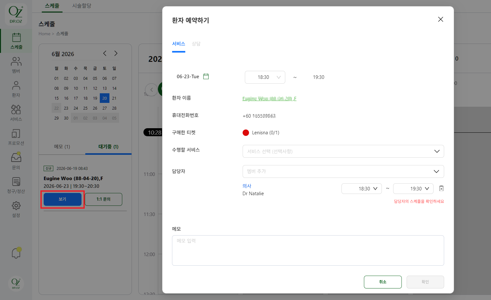

# 예약 생성

## 스케줄 예약 생성

스케줄 메뉴에서는 **서비스 예약 또는 상담 예약**을 등록할 수 있습니다.\
캘린더의 빈 시간대를 클릭하거나 우측 상단 **\[+예약]** 버튼을 클릭해 예약을 시작합니다.

<figure><figcaption></figcaption></figure>

### 서비스 예약

환자가 구매한 티켓(패키지)을 사용해 시술 또는 치료를 예약하는 경우에 선택합니다.&#x20;

① **서비스 탭에서 환자 이름을 검색합니다.**
&#x20;

* 환자 이름이 없는 경우 **\[+환자 추가]** 버튼을 누릅니다.

> 💡 환자 이름을 검색해 예약할 환자를 선택합니다. 검색 결과에 환자가 없는 경우 **\[+환자 추가]** 를 클릭합니다. **\[+환자 추가]**&#xB97C; 클릭하면 환자 메뉴로 이동해 새 환자를 등록할 수 있습니다.

<figure><figcaption></figcaption></figure>

② **구매 티켓 선택**&#x20;

환자를 선택한 후 **\[구매한 티켓]**&#xC744; 클릭해 이번 예약에 사용할 티켓을 선택합니다.

* 티켓이 없는 경우 **+티켓 추가** 버튼을 클릭합니다.

③ **예약 정보를 설정**합니다.\
**구매한 티켓에 포함된 서비스 중 이번 예약에서 진행할 서비스를 선택**하고 담당자, 날짜 및 시간을 설정합니다.

> 💡 하나의 티켓에 여러 서비스가 포함된 경우 **이번 예약에서 진행할 서비스만 선택할 수 있으며, 필요하면 여러 서비스를 함께 선택할 수 있습니다.**

<figure><figcaption></figcaption></figure>

**④ \[확인] 버튼을 클릭합니다.**\
입력한 예약 정보를 확인한 후 **\[확인]** 버튼을 클릭하여 예약을 등록합니다.

<figure><figcaption></figcaption></figure>

> 💡 날짜 변경이 필요한 경우 캘린더 아이콘을 클릭하여 예약일을 변경할 수 있습니다.

***

### **상담 예약**

신규 또는 재방문 환자를 구분하여 상담 스케줄을 예약할 수 있습니다.

상담  탭에서 **신규** 또는 **재방문**을 선택합니다. 이후 선택 유형에 따라 다음과 같이 입력합니다.&#x20;

<figure><figcaption></figcaption></figure>

#### 신규

* 환자 이름과 휴대전화번호를 입력하고 상담 일시를 설정합니다.
* 최종적으로 담당자를 선택하고 **\[확인]** 버튼을 눌러 등록합니다.&#x20;

#### 재방문&#x20;

* 환자 이름을 검색해 예약 환자를 선택합니다.&#x20;
* 검색 결과에 환자가 없는 경우 **\[+환자 추가]**&#xB97C; 클릭합니다.
* 최종적으로 담당자를 선택하고 **\[확인]** 버튼을 눌러 등록합니다.&#x20;

***

### 📌 **참고 사항**

* 서비스 예약은 사용 가능한 티켓이 있어야 생성할 수 있습니다.
* 예약 진행 상태는 **\[예약 대기] → \[예약확정] → \[완료]** 상태로 진행됩니다.&#x20;
* 메모창 하단에 티켓 쉐어 기능을 통해 다른 환자를선택하여 티켓을 함께 사용(차감)할 수 있습니다.
* 앱에서 예약 신청된 건은 \[대기중] 메뉴에서 \[보기] 버튼을 눌러확인 후 \[확인] 처리해야 예약이 확정됩니다.

<figure><figcaption></figcaption></figure>

&#x20;

***

### **❓** 자주 묻는 질문

**Q. 환자 예약하기에서 저장 버튼이 비활성화됩니다.** \
A. 필수값이 입력되지 않았는지 확인하세요. 또는 담당자의 근무시간이 아닌 경우 예약을 할 수 없습니다. 담당자의 스케줄을 확인해 주세요.

**Q. 환자 예약하기에서 환자가 조회되지 않습니다.**\
**A.** 환자 이름을 다시 확인하여 검색해 주세요. 등록되지 않은 환자인 경우 **\[+환자 추가]**&#xB97C; 클릭하여 환자를 먼저 등록해 주세요.

