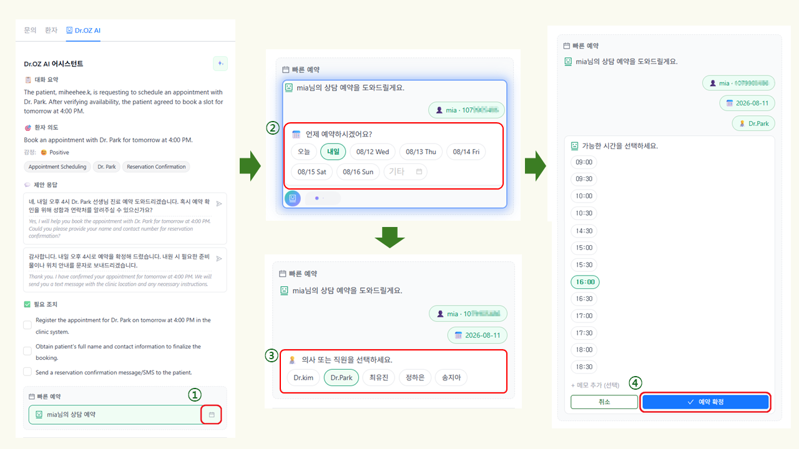

# Dr.OZ AI 상담 기능


📘 **이 페이지에서 배우는 내용**

* 대화 내용을 분석하고 AI 추천 답변 확인·전송
* 상담 화면에서 빠른 예약 생성 및 관리
* AI 답변 방식과 자동응답 상태 확인


> 💡 외국어 상담 시 환자의 언어에 맞는 답변 활용법은 [**AI 다국어 상담**](ai.md) 가이드에서 별도 안내합니다.

***

## Dr.OZ AI 패널&#x20;

Dr.OZ AI 패널은 환자와의 대화 내용을 분석하여 **대화 요약, 환자 의도·감정 분석, 추천 답변, 필요 조치 및 빠른 예약 기능**을 제공합니다. 또한 상담 중 별도의 스케줄 화면으로 이동하지 않고 예약을 생성·변경·삭제할 수 있습니다.

📌 **경로: 문의 → 수신함 → 상담 선택 → \[Dr.OZ AI]**&#x20;

> 💡 **처음 사용하시나요?**\
> Dr.OZ AI를 사용하려면 AI 모델과 지식 베이스 설정이 필요합니다. 참고로 AI 자동응답 기능은 해당 기능이 활성화된 지점에서만 표시됩니다. 초기 자세한 설정 방법은 [**AI 어시스턴트 설정**](../undefined-8/ai.md) 가이드를 확인해 주세요.

***

### Dr.OZ AI 패널 구성

Dr.OZ AI 패널에서는 **대화 요약, 환자 의도·감정 분석, 추천 답변, 필요 조치 및 빠른 예약** 기능을 확인할 수 있습니다.

* 대화 요약
* 환자 의도
* 감정
* 제안 응답
* 필요 조치
* 빠른 예약

<figure><figcaption></figcaption></figure>


**① `Dr.OZ AI` 탭** → 전체 AI 패널 열기: 대화 요약, 환자 의도, 추천 답변, 빠른 예약 등을 확인

**② `AI Suggestions` 아이콘** → AI 추천 답변만 빠르게 확인


> 💡 Dr.OZ AI 분석 결과는 상담을 돕기 위한 참고 정보입니다. 중요한 정보는 실제 상담 내용을 다시 확인해 주세요.

***

### 대화 요약 확인&#x20;

대화가 길거나 기존 상담을 다른 담당자가 이어받는 경우, AI가 생성한 **대화 요약과 환자 의도**를 통해 문의 내용을 빠르게 파악할 수 있습니다.

① 수신함에서 상담할 문의를 선택합니다.

② 오른쪽 **\[Dr.OZ AI]** 탭에서 대화 요약과 환자 의도를 확인합니다.

<figure><figcaption></figcaption></figure>

> ⚠️ AI 요약은 상담 내용을 간략하게 정리한 참고 정보입니다. 예약 날짜, 환자명, 연락처 등 중요한 정보는 실제 상담 내용에서 다시 확인해 주세요.

***

### 추천 답변 확인 및 전송

Dr.OZ AI 패널을 활성화하면 현재 대화와 병원에 등록된 정보를 바탕으로 환자에게 보낼 답변을 제안합니다.

① **제안 응답**에서 상담 상황에 적합한 **추천 답변**을 선택합니다.

② 메시지 입력창에 입력된 메시지를 확인하고 **전송** 버튼 또는 **Enter** 키를 눌러 전송합니다.

> 💡 답변 시 환자명, 날짜, 시간 등 주요 정보를 확인한 후 전송해 주세요.&#x20;
>
> * 추천 답변은 환자의 문의 상황에 맞게 필요한 부분은 수정하여 사용할 수 있습니다.&#x20;

<figure><figcaption></figcaption></figure>

> ⚠️ AI 답변은 상담을 돕기 위한 참고 정보입니다. 특히 의료적 판단이 필요한 문의에는 AI 답변만으로 안내하지 마세요.

***

### 상담 중 예약 관리

Dr.OZ AI의 **빠른 예약**을 이용하면 상담 화면에서 바로 예약을 생성하고 관리할 수 있습니다.

① **빠른 예약에서 캘린더 아이콘을 선택합니다.**

② **예약 날짜**를 선택합니다.

③ 예약을 담당할 **의사 또는 직원**을 선택합니다.

④ 예약 가능한 시간을 선택하고 예약 정보를 확인한 후 **\[예약 확정]**&#xC744; 선택합니다. 필요한 경우 메모를 입력합니다.

<figure><figcaption></figcaption></figure>

⑤ 생성된 예약을 확인한 후 전송 아이콘을 선택하여 예약 내용을 메시지 입력창에 적용합니다. 내용을 확인한 후 환자에게 전송합니다.

<figure><figcaption></figcaption></figure>

***

#### 예약 변경/삭제

생성된 예약은 **빠른 예약** 영역에서 변경하거나 삭제할 수 있습니다.

* **예약 수정**(✏️): 변경할 날짜, 시간 또는 담당자를 선택합니다.
* **예약 삭제**(❌): 삭제할 예약을 확인한 후 삭제를 확정합니다.

<figure><figcaption></figcaption></figure>

> ⚠️ 예약을 변경하거나 삭제하기 전에 환자명, 예약 날짜 및 담당자를 다시 확인해 주세요. 변경 또는 취소 후에는 환자에게 최종 예약 상태를 안내해 주세요.&#x20;

***

## AI 자동응답 활용

**Dr.OZ** 설정에 등록된 지식 베이스를 기반으로 AI가 환자의 문의를 분석하고 답변을 생성합니다.\
자동응답 설정에 따라 상담사가 AI가 생성한 답변을 확인한 후 전송하거나, AI가 환자에게 자동으로 답변하도록 설정할 수 있습니다.

🟢 **승인 후 전송**\
AI가 답변 가능한 문의에 대해 초안을 작성합니다. 상담사가 내용을 확인하고 필요한 경우 수정한 후 승인하면 환자에게 전송됩니다.

> AI: “답변할 수 있어요. 제가 초안을 만들었으니 확인하고 보내주세요.”&#x20;

🟠 **자동응답**\
AI가 답변 가능한 일반 문의에는 상담사의 승인 없이 직접 답변합니다. AI가 직접 처리하지 않는 문의는 상담사 확인이 필요합니다.

> AI: “이 문의는 제가 답변하면 안 돼요. 상담사가 직접 확인해 주세요.”&#x20;

#### **답변 방식 비교**

자동 응답 사용 여부와 답변 방식은 지점별로 설정할 수 있습니다. 참고로 지점 설정과 문의 내용에 따라 답변 처리 방식이 달라집니다.&#x20;

<table><thead><tr><th width="218">상황</th><th width="216.5555419921875">AI 동작</th><th>상담사 동작</th></tr></thead><tbody><tr><td>일반 문의 + 승인 후 전송 방식</td><td>AI가 답변 초안을 작성</td><td>상담사가 확인·수정 후 전송</td></tr><tr><td>일반 문의 + 자동응답 방식</td><td>AI가 직접 환자에게 답변</td><td>필요 시 상담 내역 확인</td></tr><tr><td>의료 문의·예약·불만 등 <code>(상담사 확인이 필요한 문의)</code></td><td>AI가 직접 답변하지 않고 <strong>상담사 확인이 필요한 상태로 표시</strong></td><td>상담사가 직접 응대</td></tr></tbody></table>

> 💡 자동응답 사용 여부, 답변 방식, 응답 범위 및 담당자 이관 조건은 「[AI 어시스턴트 설정](../undefined-8/ai.md)」에서 관리할 수 있습니다.

***

### AI 답변 상태

상담 화면에서는 AI가 생성한 답변 상태를 색상으로 구분하여 확인할 수 있습니다.

🟢 **초록색 — AI 답변 초안**\
AI가 지식 베이스를 기반으로 답변을 생성한 상태입니다. 답변 내용을 확인하고 필요한 경우 수정한 후 전송합니다.

🟠 **주황색 — 상담사 확인 필요**\
AI가 직접 답변하기 어려운 문의로 판단한 상태입니다. 상담사가 내용을 확인하고 직접 응대합니다.

<figure><figcaption></figcaption></figure>

> 📌 **우선 확인** 표시가 있는 대화는 상담사의 빠른 확인이 필요한 문의입니다. 대화 목록에서 해당 표시를 확인할 수 있습니다.

***

#### 승인 후 전송을 사용하는 경우

AI가 생성한 답변을 확인한 후 그대로 전송하거나 필요한 경우 수정할 수 있습니다.

* **수정**: AI가 생성한 답변을 수정합니다.
* **승인 후 전송**: 답변을 확인한 후 환자에게 전송합니다.
* **닫기**: 생성된 답변을 사용하지 않습니다.

<figure><figcaption></figcaption></figure>

> 💡 AI가 만든 답변을 그대로 보낼 필요는 없습니다. 환자 상황이나 병원 운영 기준에 맞게 수정한 후 전송할 수 있습니다.

***

#### 자동 응답을 사용하는 경우

자동 응답 방식에서는 AI가 답변할 수 있는 일반 문의에 대해 상담사 승인 없이 환자에게 답변합니다. 예를 들면 다음과 같습니다.

* 운영 시간
* 병원 위치 및 주차
* 서비스 안내
* 기타 지식 베이스에 등록된 일반 정보

✅ 자동 응답으로 전송된 답변은 상담 내역에서 확인할 수 있습니다. &#x20;

***

#### 상담사 확인이 필요한 경우

다음과 같은 문의는 AI가 직접 답변하지 않거나 상담사의 확인이 필요할 수 있습니다.

* **증상·통증 등 의료적 판단이 필요한 문의**
* **예약 또는 일정 변경 요청**
* **불만이나 부정적인 표현이 포함된 문의**
* **상담사 연결 요청**
* **지식 베이스에서 답변 근거를 확인하기 어려운 문의**
* **AI 자동응답 횟수 제한에 도달한 대화**

<figure><figcaption></figcaption></figure>

> 💡 상담사 확인이 필요한 대화에는 관련 안내가 표시됩니다. **우선 확인이 필요한 경우 대화 목록에서도 해당 표시를 확인할 수 있습니다.**

***

### AI 답변 사용 시 주의사항

* AI 답변은 **지식 베이스에 등록된 정보**를 기반으로 생성됩니다.
* 승인 후 전송 시에는 답변 내용을 확인하고 필요한 경우 수정한 후 전송해 주세요.
* 환자명, 일정, 가격 등 중요한 정보가 포함된 경우 실제 정보와 일치하는지 확인해 주세요.
* 자동응답을 사용하는 경우에도 상담 내역을 주기적으로 확인하는 것을 권장합니다.
* 답변이 부정확하거나 최신 정보와 다른 경우 **지식 베이스의 관련 정보를 확인하고 보완해 주세요.**

> ⚠️ AI 답변은 상담을 돕기 위한 참고 정보입니다. 특히 의료적 판단이 필요한 문의에는 AI 답변만으로 안내하지 마세요.

